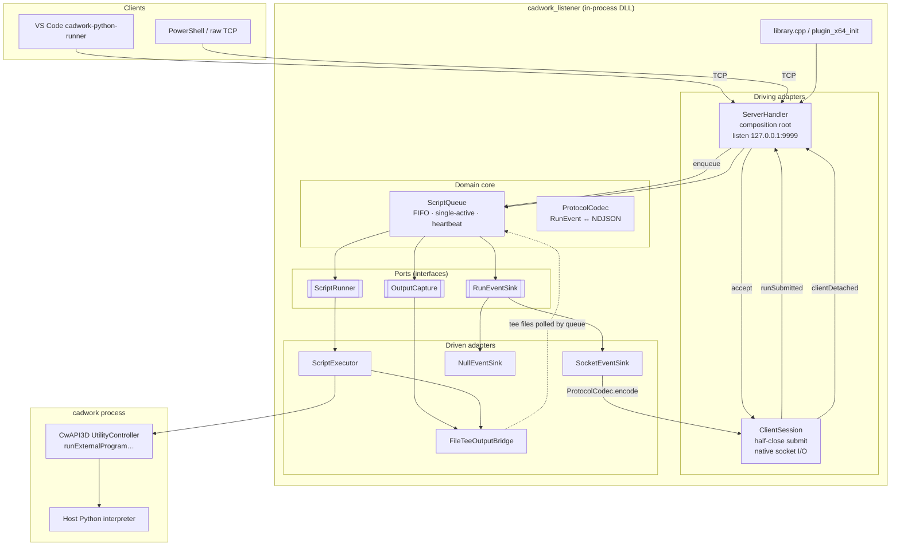
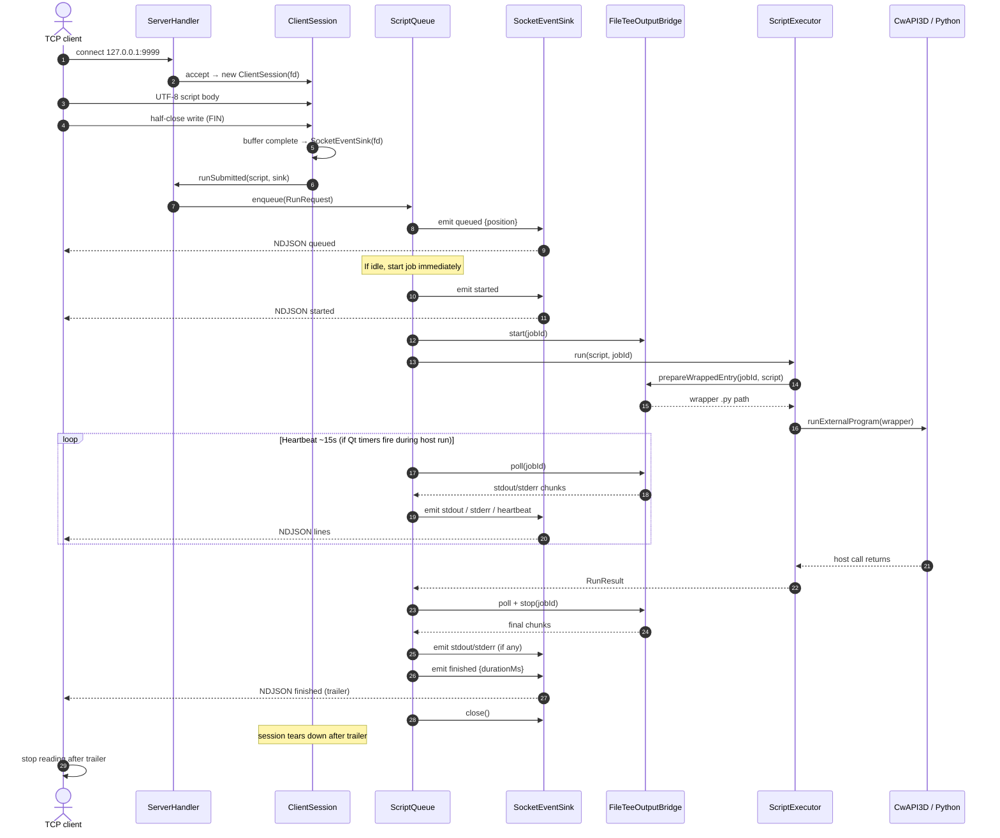
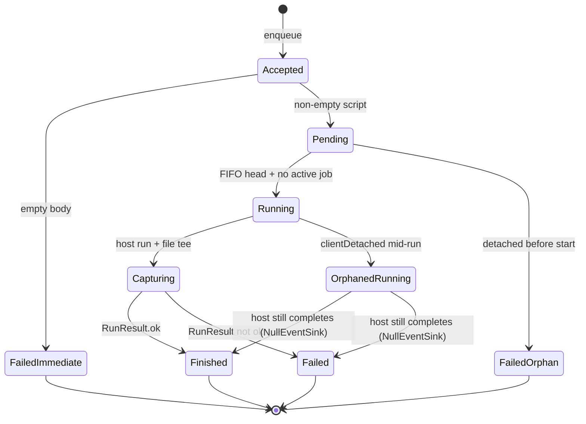

# cadwork_listener

Qt/CwAPI3D plugin that accepts Python from a local TCP client (VS Code **cadwork-python-runner** or PowerShell), runs it **one job at a time** in the open cadwork session, and streams run events back on the **same connection**.

## How it works (technical overview)

The plugin loads inside cadwork via `plugin_x64_init`, builds a `ServerHandler` composition root, and runs a nested Qt event loop so the TCP accept path stays live for the plugin lifetime.

```text
Client (VS Code / PowerShell)
        │  TCP 127.0.0.1:9999
        │  UTF-8 script + half-close (write FIN)
        ▼
  ServerHandler  ──accept──►  ClientSession
        │                         │
        │  runSubmitted(script, sink)
        ▼                         │
    ScriptQueue  ◄────────────────┘  clientDetached(jobId)
        │
        ├── RunEventSink  ──encode──►  SocketEventSink → NDJSON on socket
        │                    (or NullEventSink after orphan)
        ├── OutputCapture ──► FileTeeOutputBridge (stdout/stderr files)
        └── ScriptRunner  ──► ScriptExecutor → CwAPI3D host Python
```

Design is **hexagonal**: the domain core (`ScriptQueue` + ports) does not depend on sockets or CwAPI3D. Adapters implement the ports so unit tests can use fakes without a real cadwork process.

### Component diagram



### Components and interactions

| Component | Role | Interacts with |
|-----------|------|----------------|
| **`library.cpp`** | CwAPI3D plugin entry. Constructs `ServerHandler` and enters `runEventLoop()`. | `ServerHandler`, CwAPI3D `ControllerFactory` |
| **`ServerHandler`** | Composition root. Binds **LocalHost:9999** with a **native** listen socket (`QSocketNotifier`), accepts clients, owns queue/executor/capture. | Creates `ClientSession`; wires `runSubmitted` → `ScriptQueue::enqueue`; `clientDetached` → `ScriptQueue::onClientDetached` |
| **`ClientSession`** | One TCP connection. Buffers the UTF-8 body until **write half-close** (peer FIN). Creates `SocketEventSink` on the same FD (so replies still work after FIN — `QTcpSocket` on Windows would not). | Emits `runSubmitted(script, sink)` and `clientDetached(jobId)` to `ServerHandler` |
| **`ScriptQueue`** | Deep domain module: FIFO, **exactly one** host run at a time, job lifecycle, heartbeats (~15s), capture poll on heartbeat, orphan policy. | Calls `ScriptRunner::run`, `OutputCapture::{start,poll,stop}`, `RunEventSink::emitEvent` / `close` |
| **`ProtocolCodec`** | Pure encode/decode of `RunEvent` ↔ one NDJSON line (`\n`-terminated). | Used by `SocketEventSink` (encode); unit-tested with golden fixtures |
| **`SocketEventSink`** | `RunEventSink` adapter: writes NDJSON lines on the submitting native socket. | Owned by `ClientSession` for the connection lifetime |
| **`NullEventSink`** | Drop-all sink after client disconnect mid-job (orphan path). | Swapped in by `ScriptQueue::onClientDetached` |
| **`ScriptExecutor`** | `ScriptRunner` adapter. Writes a temp script (or FileTee wrapper entry), calls CwAPI3D to run it, maps host result → `RunResult`. | `ICwAPI3DUtilityController`, optional `FileTeeOutputBridge::prepareWrappedEntry` |
| **`FileTeeOutputBridge`** | `OutputCapture` adapter. Job-scoped temp files; Python wrapper tees `sys.stdout` / `sys.stderr`; `poll`/`stop` tail deltas into `stdout`/`stderr` events. | Used by `ScriptQueue` and `ScriptExecutor` |
| **Ports** (`ScriptRunner`, `OutputCapture`, `RunEventSink`) | Small interfaces so core logic is headless-testable. | Fakes under `tests/fakes/` |

**Why native sockets?** Clients **half-close** the write side after the script body but keep the connection open to read the NDJSON stream. On Windows, wrapping the FD in `QTcpSocket` treats peer FIN as a full disconnect and rejects further writes. `ServerHandler` / `ClientSession` / `SocketEventSink` therefore use Winsock/POSIX FDs + `QSocketNotifier` so the listener can still reply after half-close.

### Runtime sequence (happy path)



### Job lifecycle and concurrency



- Exactly **one** script executes in cadwork at a time (`ScriptQueue` FIFO).
- A second client may connect and enqueue while the first run is active (`queued.position` reflects wait order).
- Client disconnect **mid-run** does not cancel the host job; the queue swaps the sink to `NullEventSink` and continues (orphan path).
- Jobs detached **before** they start are failed without calling the host (`client detached before start`).

### Output capture

Application-level **file tee** of `sys.stdout` / `sys.stderr` (not host-logger-only):

1. `FileTeeOutputBridge::start` creates job-scoped capture files.
2. `ScriptExecutor` asks for a **wrapper** that reassigns stdout/stderr then `runpy`s the user script.
3. While the job is active, `ScriptQueue` heartbeats call `poll` (best-effort mid-run chunks if the Qt event loop runs during host execution).
4. After `ScriptRunner::run` returns, `poll` + `stop` drain remaining bytes; then the **trailer** (`finished` | `failed`) is always emitted.

---

## Supported contract (protocol v1)

> **US-17:** This README documents the **supported** wire contract.  
> **Fire-and-forget-only is not the supported contract.** Old clients that write bytes, fully close, and expect no reply may still enqueue via the orphan path, but that mode is **unsupported**.

| Item | Value |
|------|--------|
| Default bind | **LocalHost** (`127.0.0.1`), port **9999** |
| Request | Raw **UTF-8** script body, then **half-close** the write side (TCP FIN / `socket.end()` after write). Do **not** destroy the socket before reading the reply stream. |
| Response | **NDJSON** event stream: one UTF-8 JSON object per line, `\n`-terminated, until a **trailer** |

### Event types (`v:1`)

Common fields: `{"v":1,"type":"<type>","jobId":"<id>","ts":"<iso8601-optional>"}`.

| `type` | Role | Extra fields |
|--------|------|----------------|
| `queued` | Accepted onto FIFO | `position` (0 = next to run) |
| `started` | About to enter host run | — |
| `stdout` | Captured Python stdout chunk | `text` |
| `stderr` | Captured Python stderr / traceback | `text` |
| `log` | Per-run listener diagnostics | `text`, optional `level` |
| `heartbeat` | Quiet-run tick (~15s when Qt timers fire) | optional `elapsedMs` |
| `finished` | **Trailer** (success) | `durationMs`, optional `ok` |
| `failed` | **Trailer** (failure) | `durationMs`, `error` |

Exactly one of `finished` | `failed` ends the stream. Empty body → immediate `failed`.

### Concurrency

- Exactly **one** script executes in cadwork at a time (`ScriptQueue` FIFO).
- A second client may connect and enqueue while the first run is active.
- Client disconnect mid-run does not cancel the host job; the queue continues (orphan → null sink).

### Output capture

Application-level **file tee** of `sys.stdout` / `sys.stderr` (not host-logger-only). Live mid-run flush is **best-effort** when the Qt event loop can process timers during host execution; the **trailer is always** required after the host call returns.

## PowerShell sample (half-close + NDJSON)

```powershell
# US-17 PowerShell one-shot: half-close request, read NDJSON until trailer.
$script = @'
print("hello from cadwork_listener")
'@

$client = [System.Net.Sockets.TcpClient]::new()
$client.Connect("127.0.0.1", 9999)
$stream = $client.GetStream()

$bytes = [System.Text.Encoding]::UTF8.GetBytes($script)
$stream.Write($bytes, 0, $bytes.Length)
# Half-close write side; keep reading the NDJSON event stream.
$stream.Socket.Shutdown([System.Net.Sockets.SocketShutdown]::Send)

$reader = New-Object System.IO.StreamReader($stream, [System.Text.Encoding]::UTF8)
while ($null -ne ($line = $reader.ReadLine())) {
    Write-Host $line
    if ($line -match '"type"\s*:\s*"(finished|failed)"') { break }
}

$reader.Close()
$client.Close()
```

## Build

Use the CMake presets in this repo (e.g. `local-relwithdebinfo`). Plugin target: `cadwork_listener`. Headless unit tests: `listener_unit_tests` via `ctest`.

```text
cmake --preset local-relwithdebinfo
cmake --build --preset local-relwithdebinfo
ctest --test-dir cmake-build-local-relwithdebinfo --output-on-failure
```

### Source layout (high level)

| Path | Contents |
|------|----------|
| `src/library.cpp` | Plugin entry |
| `src/ServerHandler.*` | Listen / accept / wiring |
| `src/ClientSession.*` | Per-connection half-close + sink ownership |
| `src/ScriptQueue.*` | FIFO job orchestration |
| `src/ScriptExecutor.*` | CwAPI3D `ScriptRunner` |
| `src/FileTeeOutputBridge.*` | Python stdout/stderr capture |
| `src/SocketEventSink.*` / `NullEventSink.*` | Event sinks |
| `src/ProtocolCodec.*` | NDJSON codec |
| `src/ports/` | Port interfaces + `RunEvent` model |
| `tests/` | Headless unit tests + fakes + protocol fixtures |
| `docs/` | Spec, architecture, verification, session seeds |

## Scope notes

- **In scope:** FIFO queue, same-connection NDJSON stream, stdout/stderr/log/heartbeat, LocalHost bind, README contract.
- **Out of scope:** cancel-in-flight, multi-user auth, full cadwork UI/logger mirror, marketplace packaging.
